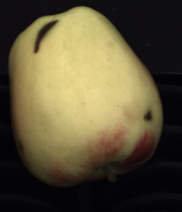
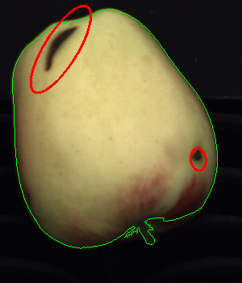

# Project Work: Analysis of Apple's Photos

## Overview

This project involves analyzing apple images to outline the fruits and identify defects. It consists of two primary tasks.

## Tasks

### First Task

1. **Binarization**: Convert grayscale images to binary using a dynamic threshold based on median pixel value.
2. **Segmentation**: Isolate the largest connected component to delineate fruit boundaries.
3. **Smoothing**: Apply smoothing techniques to remove remaining noise.
4. **Edge Detection**: Identify fruit edges using Canny edge detection.
5. **Feature Extraction**: Extract features from the segmented fruit for further analysis.
6. **Defect Highlighting**: Identify and highlight potential surface defects on the fruit.

### Second Task

1. **Color Conversion**: Convert images to LAB and HSV color spaces.
2. **Thresholding**: Apply thresholding in LAB and HSV spaces to detect defects.
3. **Distance Measurement**: Measure color differences to identify potential defects.
4. **Connected Components**: Label and analyze connected components in defect areas.
5. **Defect Contouring**: Draw contours around defects on the original images.
6. **Quantitative Assessment**: Count and report the number of defects for each image.

## Structure

The detailed steps of each task are provided in the notebooks: `first_task.ipynb` and `second_task.ipynb`.
The functions used are stored in the `tools.py` file.
